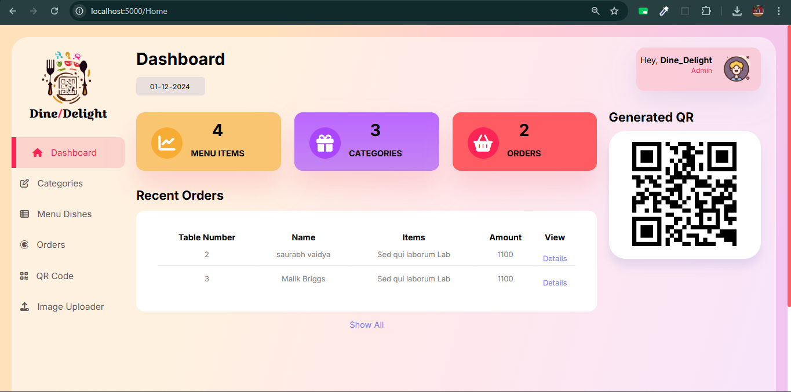
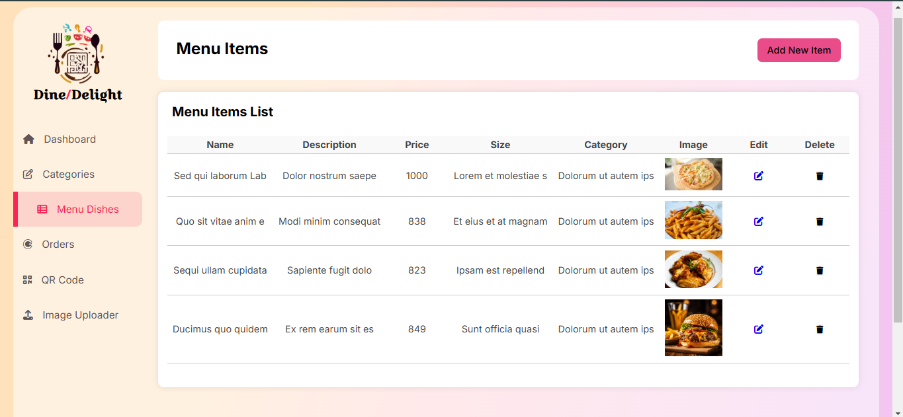
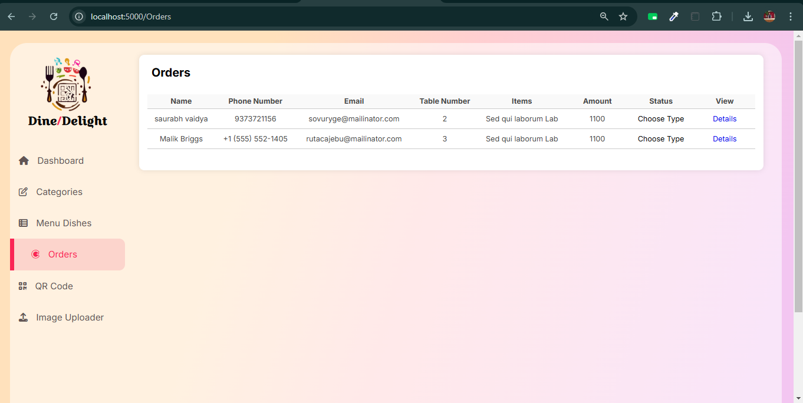
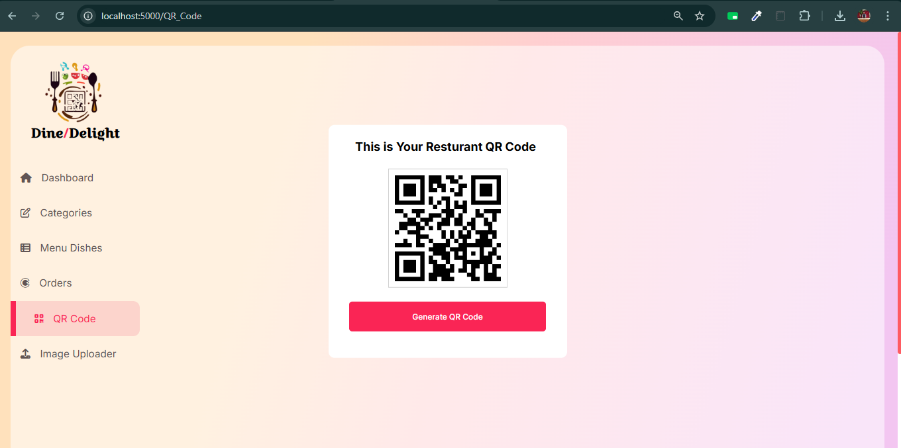
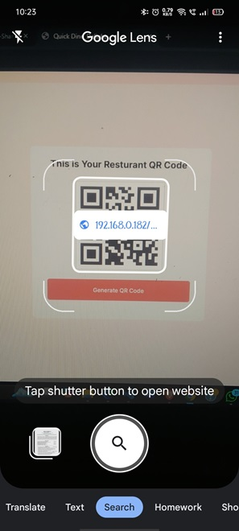
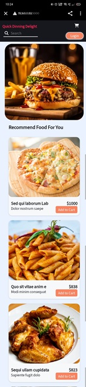
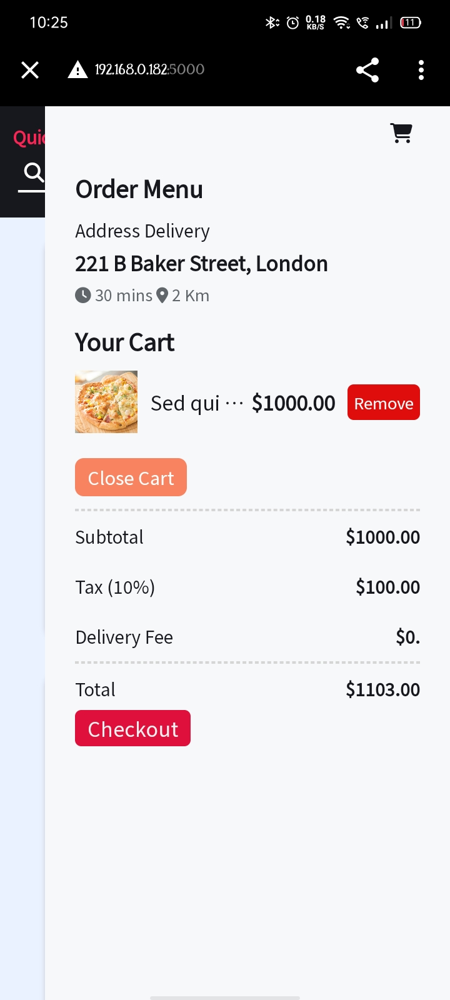
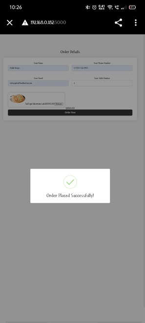

<div align="center">

# DIGITAL-MENU-SYSTEM-FOR-RESTAURANTS 

**_A modern, dynamic, and contactless digital menu platform for restaurants_**

<!-- Badges -->


**_Built with the tools and technologies:_**
<!-- Technology Badges -->


</div>

---
<div align="left">

## 📑 Table of Contents

- [Overview](#overview)
   - [Why DigitalMenu?](#-why-digitalmenu-)
   - [What the Application Does](#-what-the-application-does-)
   - [Challenges Faced](#challenges-faced)
- [Getting Started](#getting-started-)
- [Project Screenshots](#project-screenshots)
- [Team](#team-)
- [My Contribution](#my-contribution)
- [Badges](#badges)

</div>

---

<div align="left">

## Overview 

DigitalMenu is designed to transform the dining experience for restaurants and customers alike. By leveraging QR codes, responsive web technologies, and secure backend integration, it streamlines menu browsing, ordering, and payment into a simple, digital, and contactless process. 🍽️

### 🔶 Why DigitalMenu? 🤔

- To modernize and simplify the restaurant ordering process, making it both efficient and enjoyable for customers and staff.
- To reduce manual errors and waiting times, increasing table turnover and customer satisfaction.
- To enable contactless, hygienic ordering and payment, especially important in today's health-conscious world.
- To empower restaurants with real-time analytics and order management, providing insights for better business decisions.

### 🔶 What the Application Does 🍔📲

- Generates unique, dynamic QR codes for each restaurant table, enabling guests to instantly access the menu.
- Offers an interactive digital menu, complete with dish images, detailed descriptions, customizations, and pricing.
- Allows customers to browse, select, and place orders directly from their mobile devices, supporting a smooth and engaging experience.
- Provides restaurant staff with a dashboard to manage menus, track live orders, and update dish availability.
- Handles secure authentication for customers and admins, ensuring privacy and reliability.
- Integrates with backend systems to process orders, update inventory, and maintain accurate records automatically.
- Supports responsive design for all devices, ensuring a seamless experience from QR scan to order confirmation.

### 🔶 Challenges Faced 🛠️

1. **Dynamic QR Code Integration:** Ensured that each restaurant and table gets a unique QR code, making the application scalable and adaptable for any venue.
2. **Mobile View Optimization:** Carefully designed and tested the mobile user flow, from scanning the QR code to placing an order, to provide an intuitive and hassle-free experience.
3. **Robust Authentication:** Implemented secure authentication mechanisms to protect user data and sessions, using JWT and best practices.
4. **Backend Order Management:** Developed efficient backend APIs to handle every aspect of order processing, from creation to completion, ensuring data consistency and reliability.
5. **Bug Fixing & UX Improvements:** Proactively identified and fixed bugs, optimizing user experience and application stability.

## Getting Started 🚀

To set up the project locally:

1. **Clone the repository**
    ```bash
    git clone https://github.com/saurabh7071/DigitalMenu.git
    ```
2. **Install dependencies**
    ```bash
    npm install
    ```
3. **Set up environment variables**
    - Create a `.env` file based on `.env.example` and configure your settings.
4. **Start the application**
    ```bash
    npm start
    ```
</div>

## Project Screenshots
### Dashbord


This image showcases the Admin Dashboard, where the restaurant management can monitor key metrics, categories, orders, and menu items efficiently.
### Menu Dishes


This image displays the Menu Dishes Page, where customers can view a variety of food items with descriptions, prices, and images, making their selection process easier.
### Received Orders


This image illustrates the Received Orders section, where the restaurant staff can track and manage incoming orders in real time for better service.
### QR Code 


Here, we see the QR Code that customers can scan to view the restaurant's menu, making the ordering process contactless and efficient.
### QR Code Scan Through Google Lens


This image demonstrates the QR Code scan through Google Lens, allowing customers to instantly access the menu on their phones by scanning the code with ease.
### Show Menu Items After Scanning QR Code 


Once the QR code is scanned, the Menu Items Page appears, displaying the full menu for customers to browse and place orders directly from their devices.
### Cart Image After Adding Item 


This image shows the Cart after an item has been added. Customers can view their selected items and proceed with the checkout process.
### Order Confirm 


This final image demonstrates the Order Confirmation Page, where customers can review and confirm their order before submitting it for processing.

## Team 👥

- **Saurabh Vaidya** (Me)
- **Sanskruti Rathi**
- **Palak Yede Yede**

---

## My Contribution🏆

- Designed the database schema for efficient data storage and retrieval.
- Developed robust backend APIs for order management, authentication, and menu updates.
- Integrated frontend and backend components, ensuring smooth data flow and user interactions.
- Implemented dynamic QR code generation tailored to each restaurant and table.
- Proactively fixed bugs and enhanced user experience for reliability and satisfaction.

## Badges
[](https://open.vscode.dev/saurabh7071/Blockchain-Based-Fund-Management-System-For-Indian-Temples)


## 🔙 [Return](#table-of-contents)

---

**_DigitalMenu empowers restaurants with smart technology to boost customer satisfaction, streamline operations, and enhance the modern dining experience_**

