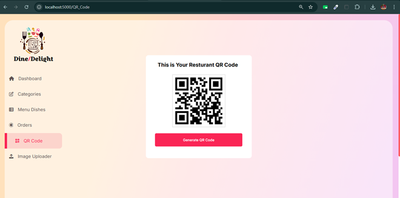

# DigitalMenu
Web-based Digital Menu System For Restaurants
## Description 
This project is a web-based Digital Menu System designed to revolutionize the dining experience for restaurants. It enables customers to browse menus, place orders, and make payments seamlessly using QR codes. By digitizing traditional menus, the system reduces wait times, enhances order efficiency, and provides a modern touch to restaurant operations.
## Key Features
* 📱 QR Code Integration: Easy access to the menu through dynamic QR codes.
* 📖 Interactive Digital Menu: Browse dishes with detailed descriptions, pricing, and availability.
* 🛒 Order Management: Customers can add items to a cart and place orders directly.
* 📊 Admin Dashboard: Manage menu items, update prices, and track orders in real time.
* 🌐 Responsive Design: Optimized for desktops, tablets, and mobile devices.
## Tech Stack
* **Frontend:** HTML5, CSS3, JavaScript
* **Backend:** Node.js, Express.js
* **Database:** MongoDB
* **Other Tools:** Qrious (QR code generation)
## Use Case
This system is ideal for restaurants looking to modernize their ordering processes, reduce manual errors, and improve the overall dining experience for customers.
## Installation
Step-by-step instructions on how to set up the project locally:
1. Clone the repository.
   
   ```bash
     git clone https://github.com/saurabh7071/DigitalMenu.git
   ```
2. Install Dependencies.

   ```bash
     npm install
   ```
3. Set up environment variables in a ```.env``` file. Provide a sample ```.env.example``` for reference.
4. Start the Application

   ```bash
     npm start
   ```
## Project Demo
### Dashbord


This image showcases the Admin Dashboard, where the restaurant management can monitor key metrics, categories, orders, and menu items efficiently.
### Menu Dishes


This image displays the Menu Dishes Page, where customers can view a variety of food items with descriptions, prices, and images, making their selection process easier.
### Received Orders


This image illustrates the Received Orders section, where the restaurant staff can track and manage incoming orders in real time for better service.
### QR Code 


Here, we see the QR Code that customers can scan to view the restaurant's menu, making the ordering process contactless and efficient.
### QR Code Scan Through Google Lens


This image demonstrates the QR Code scan through Google Lens, allowing customers to instantly access the menu on their phones by scanning the code with ease.
### Show Menu Items After Scanning QR Code 


Once the QR code is scanned, the Menu Items Page appears, displaying the full menu for customers to browse and place orders directly from their devices.
### Cart Image After Adding Item 


This image shows the Cart after an item has been added. Customers can view their selected items and proceed with the checkout process.
### Order Confirm 


This final image demonstrates the Order Confirmation Page, where customers can review and confirm their order before submitting it for processing.

## Contact  
Saurabh Vaidya - svaidya.official@gmail.com 

